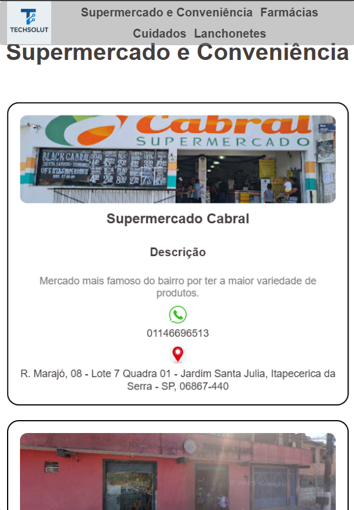
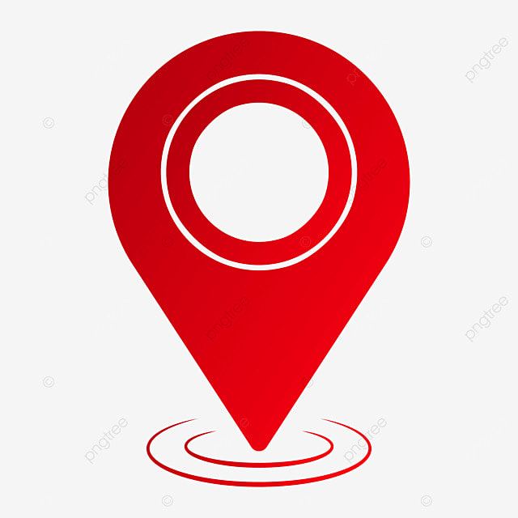
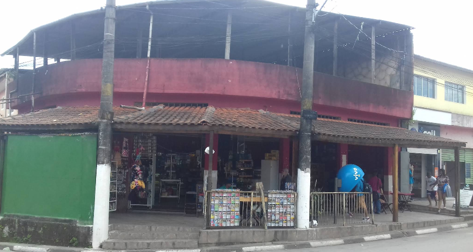
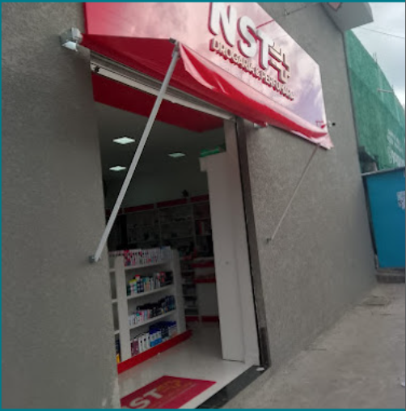

# Catalógo sobre comércios do meu bairro. #
## 💡 Sobre o projeto

Este site reúne os principais **comércios locais**, como:
- 🛒 Supermercados e mercearias  
- 💊 Farmácias  
- 💅 Cuidados e beleza  
- 🍔 Lanchonetes e restaurantes  

Cada comércio possui informações de:
- 📍 Endereço com link direto para o Google Maps  
- 📞 Contato via WhatsApp  
- 🖼️ Imagem e breve descrição  

---

## 🌐 Demonstração visual

### 💻 Visual  desktop:

### 📱 Visual mobile:

---

## 🧱 Estrutura do projeto

<!DOCTYPE html>
<html lang="pt-br"> <!-- Define o idioma da página como português do Brasil -->
<head>
    <meta charset="UTF-8"> <!-- Define o conjunto de caracteres (acentuação e símbolos) -->
    <meta name="viewport" content="width=device-width, initial-scale=1.0"> <!-- Torna o site responsivo em dispositivos móveis -->
    
    <!-- Ícone que aparece na aba do navegador -->
    <link rel="shortcut icon" href="imagens/tech-solut-header.jpg" type="image/x-icon">
    
    <!-- Importa o arquivo CSS externo para os estilos -->
    <link rel="stylesheet" href="css/estilo.css">
    
    <!-- Título que aparece na aba do navegador -->
    <title>Catálogo de Comércios</title>
</head>

<body>
    <!-- ======= Cabeçalho fixo com navegação ======= -->
    <header>
        <!-- Menu de navegação com âncoras que levam às seções da página -->
        <nav>
            <ul>
                <li><a href="#supermercado-e-conveniencia">Supermercado e Conveniência</a></li>
                <li><a href="#farmacias">Farmácias</a></li>
                <li><a href="#cuidados">Cuidados</a></li>
                <li><a href="#lanchonetes">Lanchonetes</a></li>
            </ul>
        </nav>

        <!-- Logotipo que redireciona para a página inicial -->
        
    </header>

    <!-- ======= Conteúdo principal ======= -->
    <main>

        <!-- ================= SEÇÃO: Supermercado e Conveniência ================= -->
        <section id="supermercado-e-conveniencia" class="sessao">
            <h1>Supermercado e Conveniência</h1>

            <!-- Container que agrupa os cards desta categoria -->
            

                <!-- ===== CARD 1 ===== -->
                

                    
                    <h3>Supermercado Cabral</h3>
                    <h4>Descrição</h4>
                    
Mercado mais famoso do bairro por ter a maior variedade de produtos.

                    
                    <!-- Ícone e número do WhatsApp -->
                    

                        
                        <a href="https://api.whatsapp.com/send?phone=01146696513" target="_blank">
                            
01146696513

                        </a>
                    

                    <!-- Ícone e link de localização -->
                    

                        
                        <a href="https://www.google.com/maps/place/Cabral+Supermercado/..." target="_blank">
                            
R. Marajó, 08 - Jardim Santa Julia, Itapecerica da Serra - SP

                        </a>
                    

                

                <!-- ===== CARD 2 ===== -->
                

                    
                    <h3>Padaria Trapé</h3>
                    <h4>Descrição</h4>
                    
Panificadora e mercearia próxima à quadra sintética, descendo a rua de frente ao Colégio Júlia de Castro Carneiro.

                    
                    

                        
                        
Sem-Número

                    

                    

                        
                        <a href="https://www.google.com/maps/place/Padaria+Trape/..." target="_blank">
                            
R. Girassóis, 69 - Crispim, Itapecerica da Serra - SP

                        </a>
                    

                

                <!-- ===== CARD 3 ===== -->
                

                    
                    <h3>Padaria do Rock</h3>
                    <h4>Descrição</h4>
                    
De frente à Imobiliária Soares, atua como panificadora e mercearia.

                    

                        
                        
Sem-Número

                    

                    

                        
                        <a href="https://www.google.com/maps/place/Padaria+do+Rock/..." target="_blank">
                            
R. Maria Sayeg, 187 - Jardim das Oliveiras, Itapecerica da Serra - SP

                        </a>
                    

                

            

        </section>

        <!-- ================= SEÇÃO: Farmácias ================= -->
        <section id="farmacias" class="sessao">
            <h1>Farmácias</h1>

            

                <!-- ===== CARD 1 ===== -->
                

                    
                    <h3>Farmácia Farma-Tem</h3>
                    <h4>Descrição</h4>
                    
Referência no bairro com ampla variedade de produtos e atendimento excepcional.

                    

                        
                        <a href="https://api.whatsapp.com/send?phone=011944791433" target="_blank">
                            
011944791433

                        </a>
                    

                    

                        
                        <a href="https://www.google.com/maps/place/Farmácia+-+FARMA+TEM+SAYEG/..." target="_blank">
                            
R. Maria Sayeg, 46 - Jardim das Oliveiras, Itapecerica da Serra - SP

                        </a>
                    

                

                <!-- ===== CARD 2 (exemplo resumido) ===== -->
                

                    
                    <h3>Farmácia NST</h3>
                    <h4>Descrição</h4>
                    
Medicamentos essenciais e genéricos com preços acessíveis e fácil localização.

                    

                        
                        <a href="https://api.whatsapp.com/send?phone=011919811003" target="_blank">
                            
011919811003

                        </a>
                    

                    

                        
                        <a href="https://www.google.com/maps/place/NST+Farmácia/..." target="_blank">
                            
R. Solimões, 1041 - Jardim Santa Julia, Itapecerica da Serra - SP

                        </a>
                    

                

                <!-- Demais cards seguem a mesma estrutura -->
            

        </section>

        <!-- Outras seções: Cuidados e Lanchonetes -->
        <!-- Seguem o mesmo padrão, mudando apenas o conteúdo e os links -->
    </main>
</body>
</html>

---

---

## 🧠 Tecnologias utilizadas

- **HTML5** → Estrutura e semântica  
- **CSS3** → Estilos e responsividade  
- **GitHub Pages** → Hospedagem gratuita e pública  
- **APIs externas** → WhatsApp & Google Maps Links  

---

# Acesse o site #

* Projeto em andamento 

https://yandiass621.github.io/Catalogo-de-comercios/
